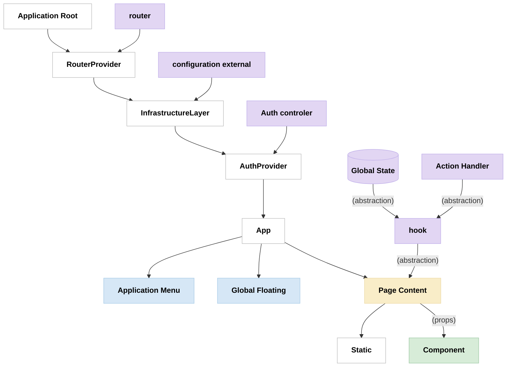

# 3.1 High-level Hierarchy & Data flow 

### Application Root
- Entry point of the application.
- Initializes the root rendering and high-level providers.

### RouterProvider
- Configures the application's routing logic.
- Defines route structure, navigation handling, and guards.

### InfrastructureLayer
- Handles global infrastructure concerns (analytics, monitoring, etc.).
- Loads and configures integrations (e.g., Google Tag Manager, Sentry).

### AuthProvider
- Manages authentication context and user session.
- Enforces access control and role-based permissions.

### App
- Main shell of the application, orchestrating layout and core flows.
- Connects providers with the main UI and global behaviors.

### Application Menu
- Sidebar or navigation menu for switching between major sections.
- Reflects user role and available routes.

### Global Floating
- Renders floating UI elements (modals, toasts, tooltips) that overlay the main content.
- Centralizes notification and overlay logic.

### Page Content
- The main dynamic area where routed pages/components are rendered.
- Hosts business logic, actions, and child components.

### Static
- Renders static assets or pages (e.g., About, Help).
- Not dependent on dynamic state or routing.

### Component
- Atomic or feature-specific UI components.
- Reusable building blocks for complex UIs.

### Action Handler
- Central point for handling user actions (e.g., form submissions, API calls).
- Coordinates with hooks and state for side effects and updates.

### hook
- Custom React hooks for managing state, effects, and business logic.
- Interfaces with global state or APIs to provide data and actions.

### Global State
- Manages shared state accessible throughout the application (e.g., Redux store, Context API).
- Stores user, session, config, and other global data.

### router
- The route configuration object or logic.
- Defines paths, parameters, guards, and lazy-loading of pages.

### configuration (gtm, sentry,...)
- External or environment-based configuration for global tools and integrations.
- Provides setup for telemetry, error tracking, and environment toggles.

### Auth controler
- Business logic for authentication processes (login, logout, token refresh).
- Validates credentials and issues/refreshes tokens.

---