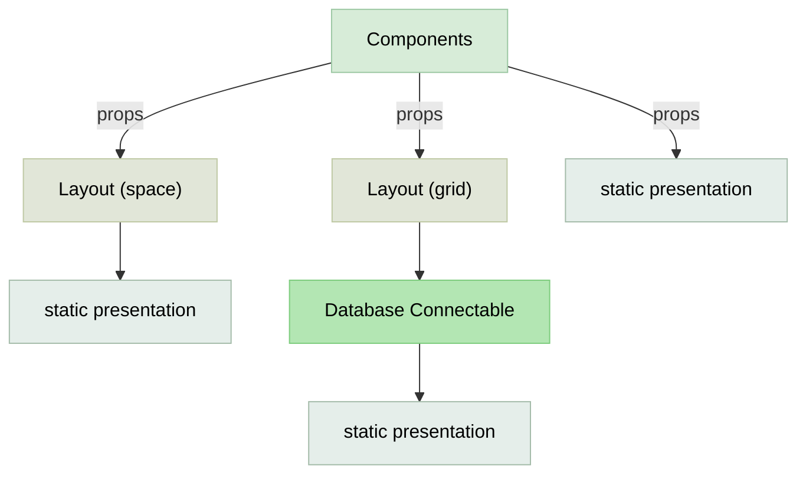

# Components Design System

| Type                    | Role                                                        | Typical Examples                                  |
|-------------------------|-------------------------------------------------------------|---------------------------------------------------|
| Static Presentation     | Show static info, icons, labels, and images                 | Text, Title, Icon, Divider, Label, Image          |
| Layout                  | Arrange and group other components responsively             | Grid, Space, GridWrapper, HStack/VStack, Flex     |
| Database Connectable    | Fetch, display, and interact with backend data or forms     | Table, Form, Drawer, List, Modal, Editable Cell   |



## 1. **Static Presentation Components**
- **Purpose:** Display content and visual cues; do not handle user input or data state.

- **Examples:**
  - **Text:** Simple text blocks, paragraphs, and inline text.
  - **Title/Heading:** Section headers, page titles.
  - **Icon:** Decorative or status-indicating icons.
  - **Divider:** Visual separators for grouping content.
  - **Image:** Static images, avatars, logos.

```tsx
// components/static/Text.tsx
import React from 'react';
import { cva, type VariantProps } from 'class-variance-authority';

// Define all variants in one place
const textVariants = cva(
  // Base classes that apply to all variants
  'leading-relaxed',
  {
    variants: {
      // Predefined semantic variants instead of individual props
      variant: {
        'body': 'text-base font-normal text-gray-900',
        'body-secondary': 'text-base font-normal text-gray-700',
        'caption': 'text-sm font-medium text-gray-600',
        'caption-muted': 'text-sm font-normal text-gray-500',
        'small': 'text-xs font-normal text-gray-500',
        'small-bold': 'text-xs font-semibold text-gray-700',
        'error': 'text-sm font-medium text-red-600',
        'success': 'text-sm font-medium text-green-600',
        'heading-small': 'text-lg font-semibold text-gray-900',
        'label': 'text-sm font-medium text-gray-900',
      },
      // Keep size separate for layout purposes
      size: {
        xs: 'text-xs',
        sm: 'text-sm',
        base: 'text-base',
        lg: 'text-lg',
      },
    },
    defaultVariants: {
      variant: 'body',
    },
  }
);

interface TextProps extends VariantProps<typeof textVariants> {
  children: React.ReactNode;
  className?: string;
  as?: 'span' | 'p' | 'div' | 'label';
}

export const Text: React.FC<TextProps> = ({
  children,
  variant,
  size,
  className,
  as: Component = 'span',
}) => {
  return (
    <Component className={textVariants({ variant, size, className })}>
      {children}
    </Component>
  );
};
```

- **Usage:**  
  Use for presenting information, branding, and enhancing UI clarity without business/data logic.
```html
// <Text variant="body">Regular text</Text>
// <Text variant="caption-muted">Subtle caption</Text>
// <Text variant="error">Error message</Text>
```

---

## 2. **Layout Components**
- **Purpose:** Structure and arrange other components for responsive and organized UI.
- **Examples:**
  - **Grid:** Responsive layout grid (e.g., 12-column, CSS Grid).
  - **Space:** Horizontal/vertical spacers for margins and paddings.
  - **GridWrapper:** Container for grid layouts, often with padding and max-width.
  - **HStack/VStack:** Horizontal or vertical stacking of children.
  - **Flex/Box:** Flexible container for arranging elements using flexbox or box model.
  - **Section/Card/Panel:** Grouping content into logical sections or cards.

```tsx
// components/layout/Grid.tsx (Extended version)
import React from 'react';
import { cva, type VariantProps } from 'class-variance-authority';

// Main Grid component (same as above)
const gridVariants = cva('grid', {
  variants: {
    variant: {
      // Layout patterns
      'single': 'grid-cols-1',
      'two-columns': 'grid-cols-1 md:grid-cols-2',
      'three-columns': 'grid-cols-1 md:grid-cols-2 lg:grid-cols-3',
      'four-columns': 'grid-cols-1 sm:grid-cols-2 md:grid-cols-3 lg:grid-cols-4',
      
      // Application-specific layouts
      'page-layout': 'grid-cols-1 lg:grid-cols-[250px_1fr] min-h-screen',
      'dashboard': 'grid-cols-1 md:grid-cols-2 lg:grid-cols-4',
      'product-grid': 'grid-cols-2 sm:grid-cols-3 md:grid-cols-4 lg:grid-cols-6',
      'card-grid': 'grid-cols-1 sm:grid-cols-2 lg:grid-cols-3 xl:grid-cols-4',
      'form-layout': 'grid-cols-1 md:grid-cols-2 max-w-2xl',
      
      // Responsive auto-fit layouts
      'auto-fit-sm': 'grid-cols-[repeat(auto-fit,minmax(200px,1fr))]',
      'auto-fit-md': 'grid-cols-[repeat(auto-fit,minmax(250px,1fr))]',
      'auto-fit-lg': 'grid-cols-[repeat(auto-fit,minmax(300px,1fr))]',
    },
    spacing: {
      'none': 'gap-0',
      'xs': 'gap-1',
      'sm': 'gap-2',
      'md': 'gap-4',
      'lg': 'gap-6',
      'xl': 'gap-8',
    },
  },
  defaultVariants: {
    variant: 'single',
    spacing: 'md',
  },
});

// Grid Item component for specific positioning
const gridItemVariants = cva('', {
  variants: {
    span: {
      '1': 'col-span-1',
      '2': 'col-span-2',
      '3': 'col-span-3',
      '4': 'col-span-4',
      '5': 'col-span-5',
      '6': 'col-span-6',
      'full': 'col-span-full',
    },
    spanRows: {
      '1': 'row-span-1',
      '2': 'row-span-2',
      '3': 'row-span-3',
      '4': 'row-span-4',
      'full': 'row-span-full',
    },
    start: {
      '1': 'col-start-1',
      '2': 'col-start-2',
      '3': 'col-start-3',
      '4': 'col-start-4',
      '5': 'col-start-5',
      '6': 'col-start-6',
    },
  },
});

interface GridProps extends VariantProps<typeof gridVariants> {
  children: React.ReactNode;
  className?: string;
  as?: React.ElementType;
}

interface GridItemProps extends VariantProps<typeof gridItemVariants> {
  children: React.ReactNode;
  className?: string;
  as?: React.ElementType;
}

// Main Grid Component
export const Grid: React.FC<GridProps> = ({
  children,
  variant,
  spacing,
  className,
  as: Component = 'div',
}) => {
  return (
    <Component className={gridVariants({ variant, spacing, className })}>
      {children}
    </Component>
  );
};

// Grid Item Component
export const GridItem: React.FC<GridItemProps> = ({
  children,
  span,
  spanRows,
  start,
  className,
  as: Component = 'div',
}) => {
  return (
    <Component className={gridItemVariants({ span, spanRows, start, className })}>
      {children}
    </Component>
  );
};

// Compound component pattern
Grid.Item = GridItem;
```

- **Usage:**  
  Use to compose page structure, control spacing, align items, and group content visually.

```tsx
// Form layouts
function FormLayout() {
  return (
    <Grid variant="form-layout" spacing="md">
      <div>
        <label>First Name</label>
        <input type="text" />
      </div>
      <div>
        <label>Last Name</label>
        <input type="text" />
      </div>
      <Grid.Item span="full">
        <label>Address</label>
        <textarea />
      </Grid.Item>
    </Grid>
  );
}
```
---

## 3. **Database Connectable Components**
- **Purpose:** Bind to data sources, fetch and display data, or interact with user input tied to business logic.
- **Examples:**
  - **Table:** Display lists or records from a database; supports sorting, filtering, pagination.
  - **Form:** Collect user input, validate, and submit to backend or database.
  - **Drawer:** Sliding panels for editing, creating, or viewing details; often used for CRUD workflows.
  - **List:** Paginated or infinite scroll lists directly tied to database queries.
  - **Modal/Dialog:** For data entry, confirmation, or detail views connected to backend.
  - **Editable Cell/Inline Edit:** Direct, in-place data editing.

```tsx
// components/database/Table.tsx
import React from 'react';
import { Text } from '../static/Text';

interface TableHeader<T> {
  key: keyof T;
  value: string;
  width?: string;
  sortable?: boolean;
}

interface TableAction<T> {
  label: string;
  onClick: (row: T) => void;
  variant?: 'primary' | 'secondary' | 'danger';
  icon?: React.ReactNode;
}

interface TableProps<T extends Record<string, any>> {
  headers: TableHeader<T>[];
  rows: T[];
  loading?: boolean;
  onRowClick?: (row: T) => void;
  renderCell?: (key: keyof T, value: any, row: T) => React.ReactNode;
  actions?: TableAction<T>[];
  className?: string;
  emptyMessage?: string;
}

export function Table<T extends Record<string, any>>({
  headers,
  rows,
  loading = false,
  onRowClick,
  renderCell,
  actions,
  className = '',
  emptyMessage = 'No data available',
}: TableProps<T>) {
  // Loading state
  if (loading) {
    return (
      <div className={`animate-pulse ${className}`}>
        <div className="h-12 bg-gray-200 rounded mb-4"></div>
        {[...Array(5)].map((_, i) => (
          <div key={i} className="h-10 bg-gray-100 rounded mb-2"></div>
        ))}
      </div>
    );
  }

  // Empty state
  if (!rows || rows.length === 0) {
    return (
      <div className={`text-center py-12 ${className}`}>
        <Text variant="body" color="secondary">
          {emptyMessage}
        </Text>
      </div>
    );
  }

  return (
    <div className={`overflow-x-auto bg-white rounded-lg shadow ${className}`}>
      <table className="min-w-full divide-y divide-gray-200">
        {/* Table Header */}
        <thead className="bg-gray-50">
          <tr>
            {headers.map((header) => (
              <th
                key={String(header.key)}
                className="px-6 py-3 text-left text-xs font-medium text-gray-500 uppercase tracking-wider"
                style={{ width: header.width }}
              >
                {header.value}
              </th>
            ))}
            {actions && actions.length > 0 && (
              <th className="px-6 py-3 text-right text-xs font-medium text-gray-500 uppercase tracking-wider">
                Actions
              </th>
            )}
          </tr>
        </thead>

        {/* Table Body */}
        <tbody className="bg-white divide-y divide-gray-200">
          {rows.map((row, rowIndex) => (
            <tr
              key={rowIndex}
              className={`
                transition-colors duration-150
                ${onRowClick ? 'cursor-pointer hover:bg-gray-50' : ''}
              `}
              onClick={() => onRowClick?.(row)}
            >
              {headers.map((header) => (
                <td
                  key={String(header.key)}
                  className="px-6 py-4 whitespace-nowrap text-sm"
                >
                  {renderCell
                    ? renderCell(header.key, row[header.key], row)
                    : <Text variant="body">{row[header.key]}</Text>
                  }
                </td>
              ))}
              
              {/* Actions Column */}
              {actions && actions.length > 0 && (
                <td className="px-6 py-4 whitespace-nowrap text-right text-sm font-medium">
                  <div className="flex justify-end space-x-2">
                    {actions.map((action, actionIndex) => (
                      <button
                        key={actionIndex}
                        onClick={(e) => {
                          e.stopPropagation(); // Prevent row click
                          action.onClick(row);
                        }}
                        className={`
                          px-3 py-1 rounded text-xs font-medium transition-colors
                          ${action.variant === 'danger'
                            ? 'text-red-600 hover:text-red-900 hover:bg-red-50'
                            : action.variant === 'secondary'
                            ? 'text-gray-600 hover:text-gray-900 hover:bg-gray-50'
                            : 'text-blue-600 hover:text-blue-900 hover:bg-blue-50'
                          }
                        `}
                      >
                        {action.icon && <span className="mr-1">{action.icon}</span>}
                        {action.label}
                      </button>
                    ))}
                  </div>
                </td>
              )}
            </tr>
          ))}
        </tbody>
      </table>
    </div>
  );
}
```
- **Usage:**  
  Use when you need to fetch, display, update, or sync data with a backend or API. Typically involve state, effects, and user interaction logic.

```tsx
// App.tsx or pages/operators.tsx
import React from 'react';
import { OperatorList } from './components/features/OperatorList';

function App() {
  return (
    <div className="min-h-screen bg-gray-50">
      <OperatorList />
    </div>
  );
}

export default App;
```

---