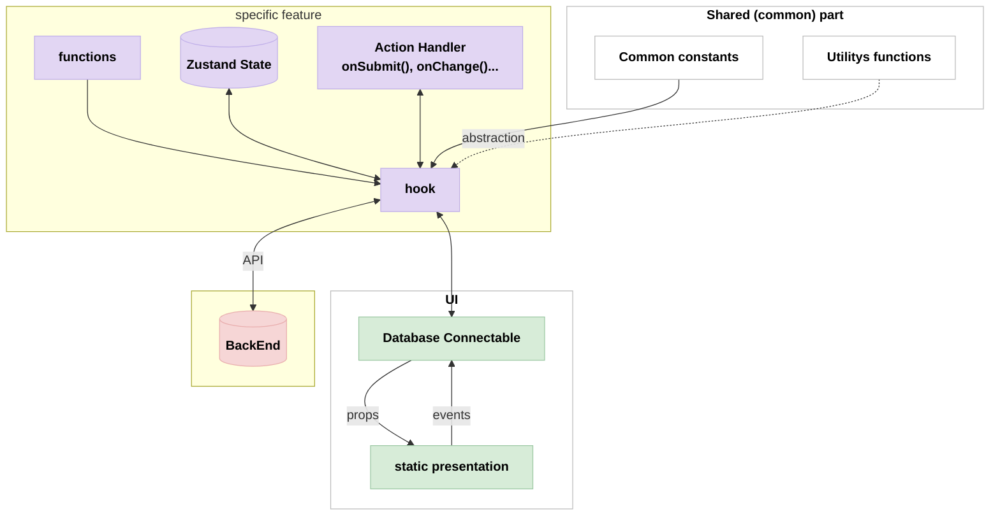

# Database Connectable component
## **Summary Table**

| Block                      | Description                                                                                      |
|----------------------------|--------------------------------------------------------------------------------------------------|
| functions (`F`)            | Feature-specific business logic                                                                  |
| Zustand State (`Z`)        | Local/global state management for feature                                                        |
| Action Handler (`AH`)      | Handles UI-driven actions and event dispatching                                                  |
| hook (`HK`)                | Custom hooks, central logic hub for state, actions, and side effects                             |
| static presentation (`SP`) | Stateless display components, render via props                                                   |
| Database Connectable (`DB`)| Data-driven components (Table, Form, Drawer), interact with backend/state                        |
| Common constants (`CC`)    | Shared constants for consistency                                                                 |
| Utility functions (`UF`)   | Generic helpers for formatting, validation, etc.                                                 |
| BackEnd (`BE`)             | External API/backend, source of persistent data and business rules                               |
