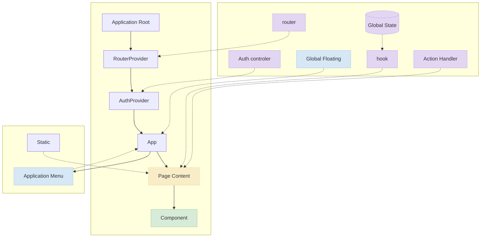

# 3.1 High-level Hierarchy & Data flow 

```mermaid
flowchart TD
    subgraph Providers [ ]
        direction TB
        AR[Application Root]
        RP[RouterProvider]
        AP[AuthProvider]
        App[App]
        PC[Page Content]
        Comp[Component]
    end

    subgraph Left [ ]
        direction TB
        router[router]
        router -.-> RP
        authc[Auth controler]
        authc -.-> AP
        gf[Global Floating]
        gf -.-> App
        ah[Action Handler]
        ah -.-> PC
        gs[(Global State)]
        hook[hook]
        gs -.-> hook
        hook -.-> PC
    end

    subgraph Right [ ]
        direction TB
        am[Application Menu]
        am -.-> App
        st[Static]
        st -.-> PC
    end

    AR --> RP
    RP --> AP
    AP --> App
    App --> am
    App --> PC
    PC --> Comp

    style router fill:#e2d6f3,stroke:#bfaee9
    style authc fill:#e2d6f3,stroke:#bfaee9
    style gf fill:#d6e7f6,stroke:#a7cbe7
    style am fill:#d6e7f6,stroke:#a7cbe7
    style ah fill:#e2d6f3,stroke:#bfaee9
    style hook fill:#e2d6f3,stroke:#bfaee9
    style gs fill:#e2d6f3,stroke:#bfaee9
    style PC fill:#f9edc8,stroke:#ecd9a4
    style Comp fill:#d7ecd8,stroke:#9dc8a4
```
