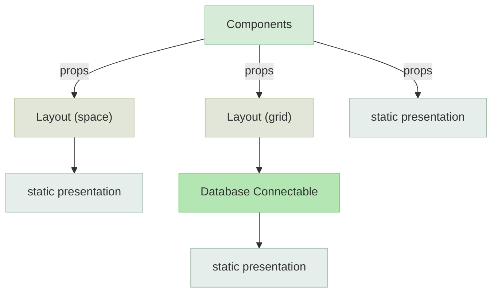

# Components Design System

1. Layout: Gird, Space: GridWrapper, HStack
2. Database Connectable: Table, Form, Drawer.
3. Static presentation: text, paragraph, Title, Icon...

```mermaid
flowchart TD
    Components["Components"]
    LayoutSpace["Layout (space)"]
    LayoutGrid["Layout (grid)"]
    Static1["static presentation"]
    Static2["static presentation"]
    Static3["static presentation"]
    Database["Database Connectable"]

    Components -- "props" --> LayoutSpace
    Components -- "props" --> LayoutGrid
    Components -- "props" --> Static1

    LayoutSpace --> Static2
    LayoutGrid --> Database

    Database --> Static3

    style Components fill:#d7ecd8,stroke:#9dc8a4
    style LayoutSpace fill:#e1e6d8,stroke:#bfc9a4
    style LayoutGrid fill:#e1e6d8,stroke:#bfc9a4
    style Database fill:#b3e6b3,stroke:#7dcc7d
    style Static1 fill:#e5eeea,stroke:#a5bcaa
    style Static2 fill:#e5eeea,stroke:#a5bcaa
    style Static3 fill:#e5eeea,stroke:#a5bcaa
```
