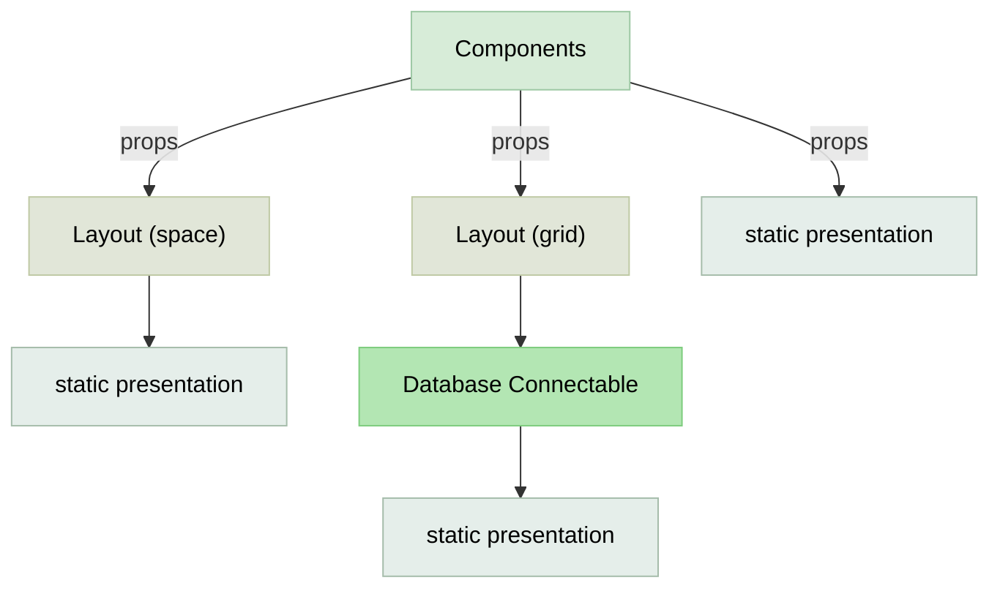

# Components Design System

| type component         | Explain                                 |
|------------------------|--------------------------------------------|
| Static Presentation    | Text, Paragraph, Title, Icon, ...          |
| Layout                 | Grid, Space, GridWrapper, HStack           |
| Database Connectable   | Table, Form, Drawer                        |

